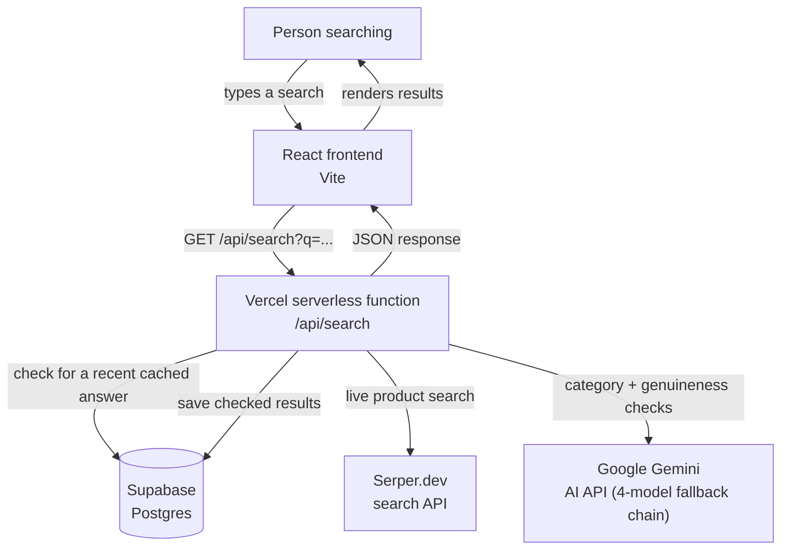
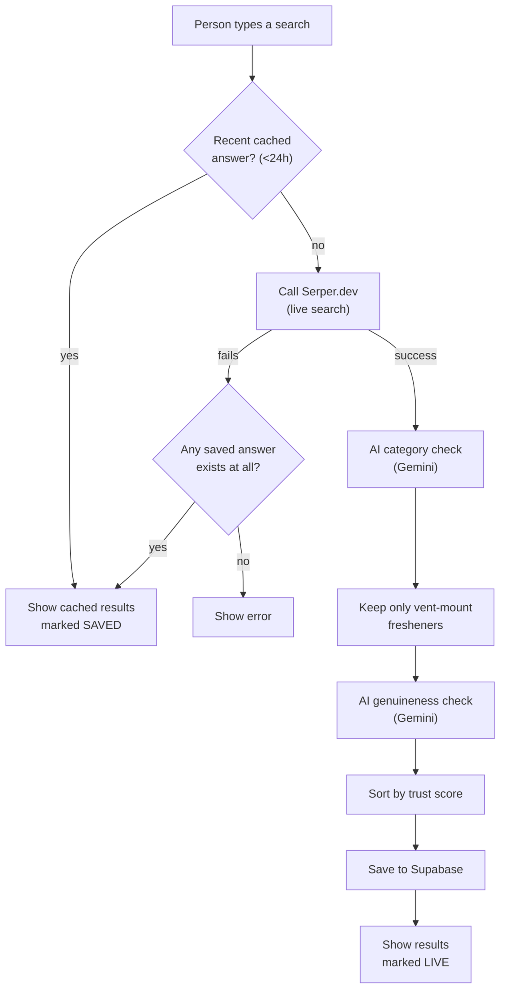

# Vent Freshener Search — Simple Version

Implementation of `Project_Plan_ALI_Simple.docx` (v3.1). A search tool for car AC
vent-mount air fresheners: live web search + AI category/genuineness checks +
offline fallback.

**Stack:** React (Vite) frontend + Vercel serverless functions (`/api`) + Supabase (Postgres)

**Live app:** https://vent-search-simple.vercel.app

---

## Research task (required write-up)

### Search API: Serper.dev
Serper.dev was chosen because it is genuinely free (2,500 one-time free
queries, no recurring charge required to get started) and does not ask for
a credit card at signup. Its "shopping" search type returns exactly the
fields this project needs per product — title, price, rating, review count,
image, and a direct link — without any extra parsing. It is also fast
(typically 1-2 second response times), which keeps live search feeling
responsive.

### AI API: Google Gemini
Google Gemini (via Google AI Studio) was chosen because it offers a
genuinely permanent free tier (not just a one-time trial credit), with no
credit card required at any point. It has a real, documented API suited to
programmatic use (unlike some competitors whose free access is limited to
a consumer chat app), which is exactly what's needed to send batched
product data and get structured JSON answers back for both the category
check and the genuineness check.

---

## Day 1 setup (do this first)

### 1. Install dependencies
```bash
npm install
```

### 2. Get your Serper.dev API key
1. Sign up at [serper.dev](https://serper.dev) — no credit card needed
2. Copy your API key from the dashboard

### 3. Set up local environment variables
```bash
cp .env.example .env
```
Open `.env` and paste your Serper key into `SERPER_API_KEY=`. Leave the Gemini/Supabase
lines blank for now — Day 1 doesn't need them yet.

### 4. Install the Vercel CLI (runs both frontend + serverless functions together)
```bash
npm install -g vercel
vercel dev
```
This starts everything at `http://localhost:3000`.

### 5. Test it
Open `http://localhost:3000`, type a search like "lavender vent air freshener", hit Search.
You should see raw JSON with real product results from Serper.

**If it fails:** check the terminal running `vercel dev` for the exact error — usually a
missing or wrong `SERPER_API_KEY`.

---

## GitHub — commit as you go (this is graded, see SRS Section 10)

### First-time setup
```bash
git init
git add .
git commit -m "Project scaffold: Vite frontend, Vercel API folder, Supabase schema"
git branch -M main
git remote add origin <your-empty-github-repo-url>
git push -u origin main
```

### After Day 1 feature 1 (live search) works
```bash
git add api/search.js api/lib/serper.js
git commit -m "Add live search API integration

Calls Serper.dev's Google Shopping engine and returns normalized
product results (name, price, rating, review count, image, link)."
git push
```

Don't commit `.env` — it's already in `.gitignore`, so your API key stays private.

---

## Architecture



**Why this shape:** the frontend never talks to Serper, Supabase, or Gemini directly — every
external call goes through the one serverless function, so API keys stay server-side and never
reach the browser.

## Search workflow



This mirrors SRS Section 5 exactly: cache-first, live search with an offline fallback, then the
two AI checks in sequence, then save-and-display. If either AI check fails (not just Serper), the
same saved-answer fallback in the diagram above kicks in — handled in `api/search.js`.

---


All 6 required features (SRS Section 6) are implemented:

| # | Feature | Where |
|---|---|---|
| 1 | Live search via Serper.dev | `api/lib/serper.js`, `api/search.js` |
| 2 | Save results to Supabase + offline/saved fallback | `api/lib/cache.js`, `api/lib/supabase.js` |
| 3 | AI category check (Gemini) | `api/lib/gemini.js` — `checkCategoryBatch` |
| 4 | AI genuineness check (Gemini) | `api/lib/gemini.js` — `checkGenuinenessBatch` |
| 5 | Sort by most trustworthy first | `api/search.js` |
| 6 | Results page UI (photo, price, rating, Live/Saved tag, Genuine/Not Sure tag) | `src/App.jsx`, `src/components/ProductCard.jsx`, `src/App.css` |

Feature 7 (manual refresh button) was skipped per the plan's own priority guidance
("skip this first if running low on time").

### Robustness additions beyond the base spec
- Gemini calls automatically retry on transient 503/429 errors before failing.
- The saved/offline fallback triggers on **any** pipeline failure (Serper down,
  or either AI check down), not just Serper — matching the "AI service downtime"
  risk called out in Section 12.
- Cache reads re-verify `is_vent_freshener` before returning results, so a
  stale/pre-AI-check cache entry can never resurface off-category products.

### Section 8 accuracy proof
A manually curated list of 10 genuine vent fresheners and 10 fake/wrong-category/
spam listings (`test-accuracy.js`) was run against both AI checks:
- Category check accuracy: **20/20 (100%)**
- Genuineness check accuracy: **13/13 (100%)**

Run it yourself with `node test-accuracy.js` (requires `GEMINI_API_KEY` in `.env`).

### Deployment
- Code: pushed to GitHub, feature-by-feature commit history (see `git log --oneline`)
- Hosting: Vercel (auto-deploys on push to `main`)
- Database: Supabase (Postgres)
- Live: https://vent-search-simple.vercel.app